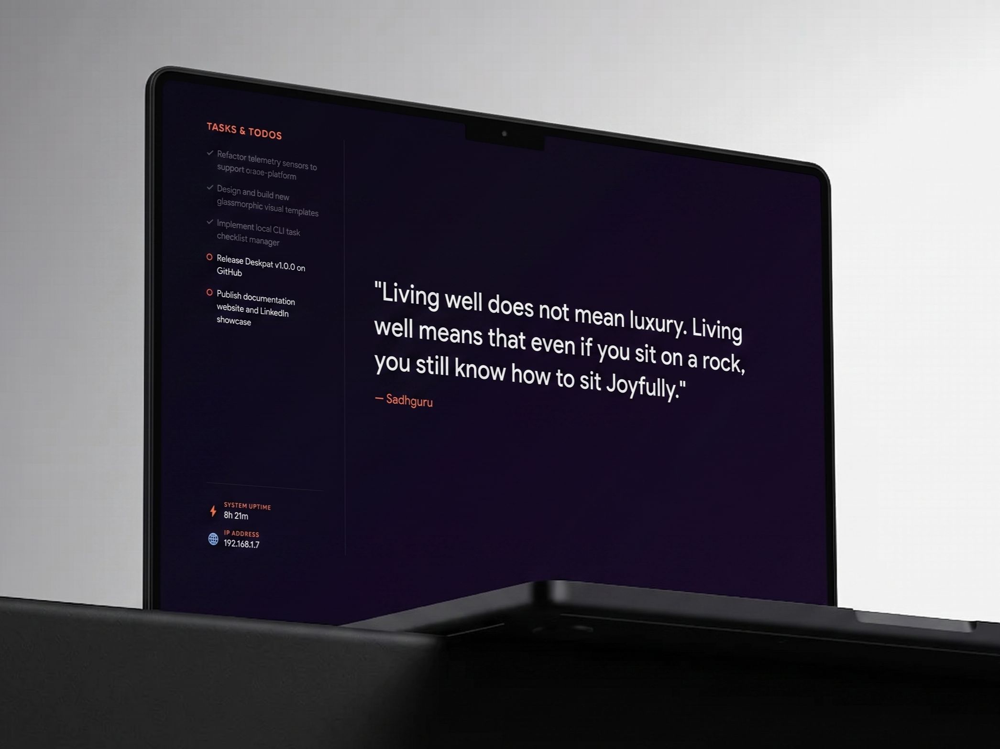

# 💻 DESKPAT: Spanned Wallpaper & System Dashboard

Welcome to **DESKPAT** (derived from the Hindi word **पट (Pat)**, meaning *screen, canvas, or backdrop*), a modular, spanned multi-monitor wallpaper generator and real-time developer status HUD. Turn your empty desktop workspace into an elegant, custom-rendered dashboard.



> [!NOTE]
> **OS Compatibility Support**:
> * **Windows**: Fully supported and tested.
> * **macOS & Linux**: Core telemetry queries, multi-monitor display calculations, and background setters are implemented but currently **untested/experimental**. If you run these platforms, feedback and pull requests are highly welcome!

---

## ✨ Features

* 📐 **Display Spanning**: Dynamically queries monitor coordinates, resolutions, and scaling factors to compile a single unified wallpaper canvas spanning all screens.
* 📊 **Live Diagnostics**: Built-in telemetry sensors track system uptime, local IP address, RAM/CPU load, and custom registered variables.
* 📋 **Todo Checklist CLI**: Interactively append, complete, and clear tasks from your checklist directly using CLI commands.
* 🎨 **HTML/CSS Visual Templates**: Design and render layouts using modern web technologies (compiled via headless Puppeteer).
* 🔌 **Scriptable Fetchers**: Execute custom scripts (Node.js, Python, PowerShell, or Bash) to pull dynamic external APIs (quotes, weather, RSS feeds) into your background.

---

## 📂 Project Structure

All core implementation files are stored in `deskpat_src/` to keep your root directory clean:

```text
deskpat/
│
├── deskpat.bat / deskpat.ps1  # Root wrappers (launchers)
├── README.md                  # This guide
├── deskpat_promo.png          # Promotional banner
└── deskpat_src/
    ├── deskpat.py             # Python orchestrator & monitor engine
    ├── sensors.py             # System telemetry sensor plugins
    ├── render.js              # Puppeteer HTML screenshot render engine
    ├── config.json            # Theme & default configurations
    ├── todo.json              # Local tasks list database
    ├── data.json              # Standardized API payload context
    ├── scripts/               # Custom fetchers folder
    │   ├── sadhguru.js        # Dynamic quotes & feeds fetcher
    │   └── template.js        # Fetcher boilerplate template
    └── templates/             # HTML layout templates
        ├── default/           # Glassmorphic full-stats dashboard
        └── minimal/           # Joyful split layout (Checklist & Quotes)
```

---

## ⚡ Quick Start & Setup

### 1. Prerequisites
Ensure you have the following installed on your computer:
* **Python 3.x** (with `pip` in your system `PATH`)
* **Node.js & npm** (with `node` in your system `PATH`)

### 2. Dependency Initialization
When you run the tool for the first time, it automatically installs any missing dependencies:
* **Python**: `Pillow` (PIL) library
* **Node.js**: `puppeteer` (headless compiler)

### 3. Running the Engine
To fetch the latest data, build the layout canvas, and set the Span desktop wallpaper, run the launcher for your shell:

```bash
# Using Batch (Windows CMD)
.\deskpat.bat

# Using PowerShell
.\deskpat.ps1

# Directly via Python
python deskpat_src/deskpat.py
```

---

## ⏰ Pro-Tip: Automate Updates with Task Scheduler

To re-apply the generated wallpaper after Windows sign-in, register a current-user logon task. The 30-second delay gives Windows time to initialize the monitor layout before Deskpat generates the spanned wallpaper.

### On Windows (via PowerShell)
Run this command from the project root. Administrator PowerShell is not required for the current-user task:

```powershell
$taskName = "Deskpat-AtLogon"
$deskpat = "C:\SOFTWARES\deskpat\deskpat.ps1"

$action = New-ScheduledTaskAction `
  -Execute "powershell.exe" `
  -Argument "-NoProfile -ExecutionPolicy Bypass -WindowStyle Hidden -File `"$deskpat`"" `
  -WorkingDirectory "C:\SOFTWARES\deskpat"

$trigger = New-ScheduledTaskTrigger -AtLogOn -User $env:USERNAME
$trigger.Delay = "PT30S"

$settings = New-ScheduledTaskSettingsSet `
  -StartWhenAvailable `
  -AllowStartIfOnBatteries `
  -DontStopIfGoingOnBatteries

Register-ScheduledTask `
  -TaskName $taskName `
  -Action $action `
  -Trigger $trigger `
  -Settings $settings `
  -Description "Run Deskpat wallpaper generator after user logon" `
  -Force
```

Verify the task without signing out:

```powershell
Start-ScheduledTask -TaskName "Deskpat-AtLogon"
Get-ScheduledTaskInfo -TaskName "Deskpat-AtLogon" |
  Select-Object LastRunTime, LastTaskResult
```

`LastTaskResult` should be `0`. You can also confirm Windows is caching the correct spanned wallpaper dimensions:

```powershell
Add-Type -AssemblyName System.Drawing
$path = "$env:APPDATA\Microsoft\Windows\Themes\TranscodedWallpaper"
$img = [System.Drawing.Image]::FromFile($path)
try {
  [pscustomobject]@{ Width = $img.Width; Height = $img.Height }
} finally {
  $img.Dispose()
}
```

For a two-monitor layout, the cached dimensions should match the full virtual desktop canvas, not a single monitor. For example, a 2560x1440 primary plus a 1920x1080 secondary may produce a `4480x1440` spanned cache.

Remove the task if needed:

```powershell
Unregister-ScheduledTask -TaskName "Deskpat-AtLogon" -Confirm:$false
```

### On macOS / Linux (via Cron)
Add a crontab entry to execute the orchestrator:
```bash
# Run crontab -e and append:
*/15 * * * * cd /path/to/deskpat && ./deskpat.bat >/dev/null 2>&1
```

---

## 🛠️ CLI Options

The orchestrator CLI accepts arguments to override default configurations:

| Option | Description |
| :--- | :--- |
| `--script <file>` | Run a custom data fetcher script from `scripts/` (e.g. `--script sadhguru.js`) |
| `--template <name>` | Render a specific layout template folder (e.g. `--template default`) |
| `--url <api_url>` | Fetch raw text or JSON data directly from a web URL (bypassing custom scripts) |
| `--select` | Interactively list and pick an available template in the console |

*Note: Any unrecognized arguments are automatically forwarded straight to your custom script (e.g. `deskpat --script my_script.py --city "Seattle"`).*

---

## 📋 Local Todo Subcommand

DESKPAT includes a built-in command-line task checklist manager. Running these commands will modify `todo.json`, and the changes will render on your desktop checklist instantly on the next background update:

| Command | Description |
| :--- | :--- |
| `deskpat todo list` | List all active checklist tasks |
| `deskpat todo add "Task"` | Add a new task to your checklist |
| `deskpat todo done <index>` | Toggle completion status of task `<index>` (e.g. `deskpat todo done 1`) |
| `deskpat todo remove <index>`| Remove task `<index>` from the checklist |
| `deskpat todo clear` | Clear all tasks |

---

## 🔌 Extensibility & Customization

### 1. Writing Custom Data Fetchers
You can drop scripts into `deskpat_src/scripts/`. Fetcher scripts can be written in **Node.js (`.js`)**, **Python (`.py`)**, **PowerShell (`.ps1`)**, or **Shell (`.sh`/`.bat`)**.
* **Requirement**: The script must output a clean JSON object to `stdout`.
* The orchestrator automatically executes your script, parses its output, and saves it into `data.json`.

### 2. Creating New Visual Layouts
Templates are stored under `deskpat_src/templates/`. To build your own:
1. Create a folder (e.g., `templates/custom-dashboard/`).
2. Add a `template.html` and `style.css`.
3. In `template.html`, read the global context `window.wallpaperData` in JavaScript to populate your fields.
4. Set it as default in `config.json` or call `deskpat --template custom-dashboard`.

### 3. Adding New Modular OS/System Sensors
OS-level metrics are queried via `deskpat_src/sensors.py`. To add a new system stat (e.g., free disk space, CPU temperature, or battery level):
1. Open `sensors.py` and write a Python function.
2. Register it using the `@sensor("metric_name")` decorator.

```python
@sensor("disk_free_gb")
def get_disk_free():
    import shutil
    total, used, free = shutil.disk_usage("/")
    return round(free / (1024**3), 1)
```

This variable automatically loads into `data.json` and becomes instantly available inside your HTML templates in JavaScript at `window.wallpaperData.system.disk_free_gb`!
